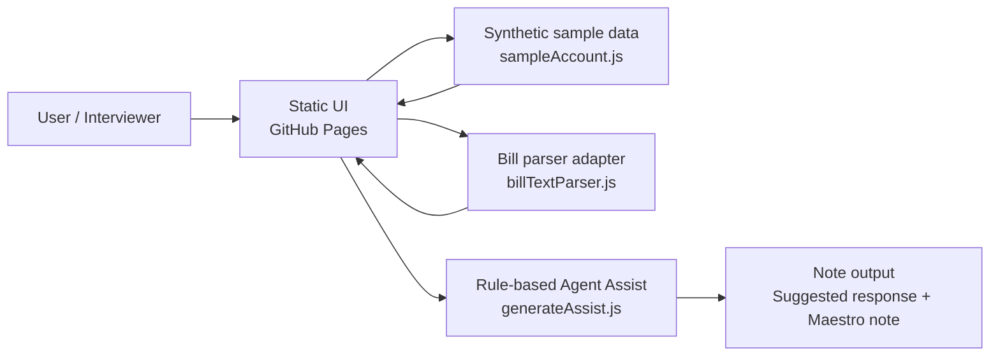

# Architecture Diagram

This is the public static demo architecture. It is intentionally simple and privacy-safe.

## Plain-English Flow

1. The user opens the GitHub Pages demo.
2. The static UI loads synthetic sample account data.
3. The bill parser adapter represents how uploaded or extracted bill text could become structured bill data.
4. The rule-based Agent Assist reads the bill state and live transcript text.
5. The app outputs a suggested response, follow-up question, and copy-ready Maestro note.

## Production Gap

The public demo does not include production authentication, real billing-system access, Maestro integration, live offer eligibility, or real customer data storage.

